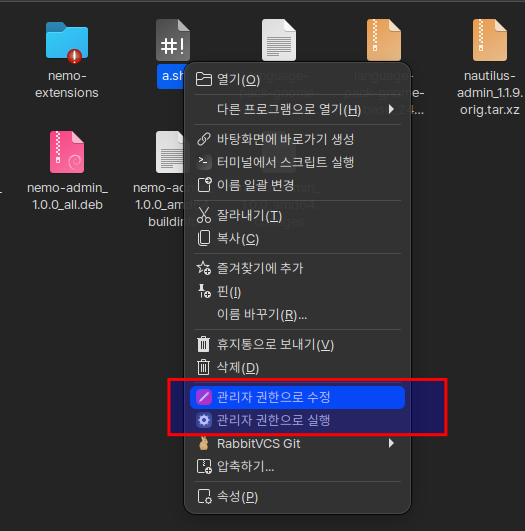

Nemo Admin
==============

Nemo Admin is a simple Python extension for the Nemo file manager that
adds some administrative actions to the right-click menu:

*   **Open as Administrator**: opens a folder in a new Nemo window running
    with administrator (root) privileges.
*   **Edit as Administrator**: opens a file in a Xed window running with
    administrator (root) privileges.

## Download

You can download the latest version of the extension from the
[Releases][download] page.

## Reporting bugs

You can report bugs and ask questions at the extension's [issue tracker][issues].

[download]: https://github.com/hamonikr/nemo-admin/releases
[issues]: https://github.com/hamonikr/nemo-admin/issues